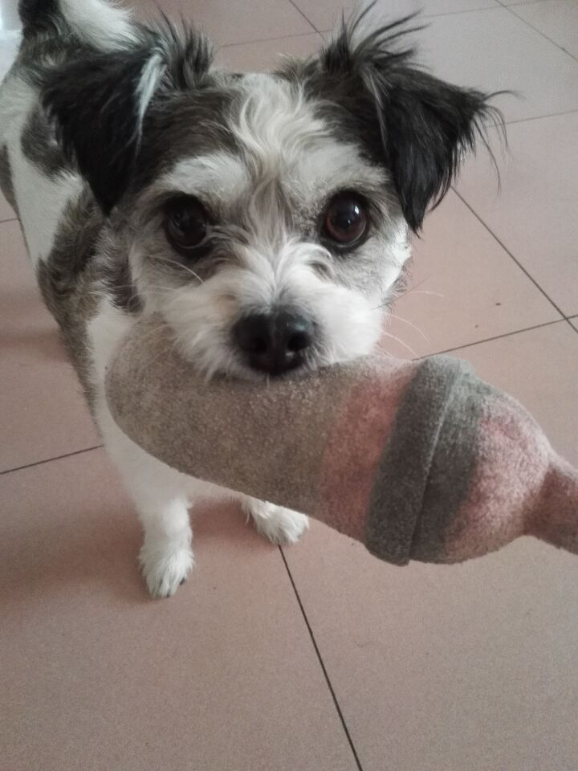

# Desktop AI Pet

Desktop AI Pet is a small desktop companion built with Electron.

It lives directly on your desktop and can be dragged around, interacted with, and display different behaviors and expressions.

The current version includes:

* Desktop pet interaction
* Dragging
* Speech bubbles
* Tail-wagging animation
* Blink, happy, talk, walk, idle, and sleep states
* Random behaviors
* System tray controls
* Show / Hide / Quit
* Windows auto-start

The long-term goal is to turn it into an AI personal assistant that can help manage tasks, create plans, remind users what they need to do, and interact with other applications.

---

## Meet Nainiu 🐶

The character in this project is based on my dog, **Nainiu (奶牛)**.

She is **15 years old in 2026**.

I decided to use her as the first character for this project, so the desktop pet is based on her appearance and expressions.



---

## Download & Install

### Windows

1. Go to the **Releases** section of this GitHub repository.
2. Open the latest release.
3. Download:

```text
AI Desktop Pet Setup.exe
```

4. Double-click the installer.
5. Follow the installation steps.
6. Launch **AI Desktop Pet**.

After launching, Nainiu will appear on your desktop.

You can also find the application in the Windows system tray, where you can:

* Show the pet
* Hide the pet
* Quit the application

No Internet connection is required for the basic desktop pet functionality.
